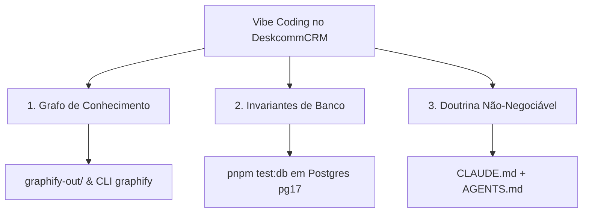
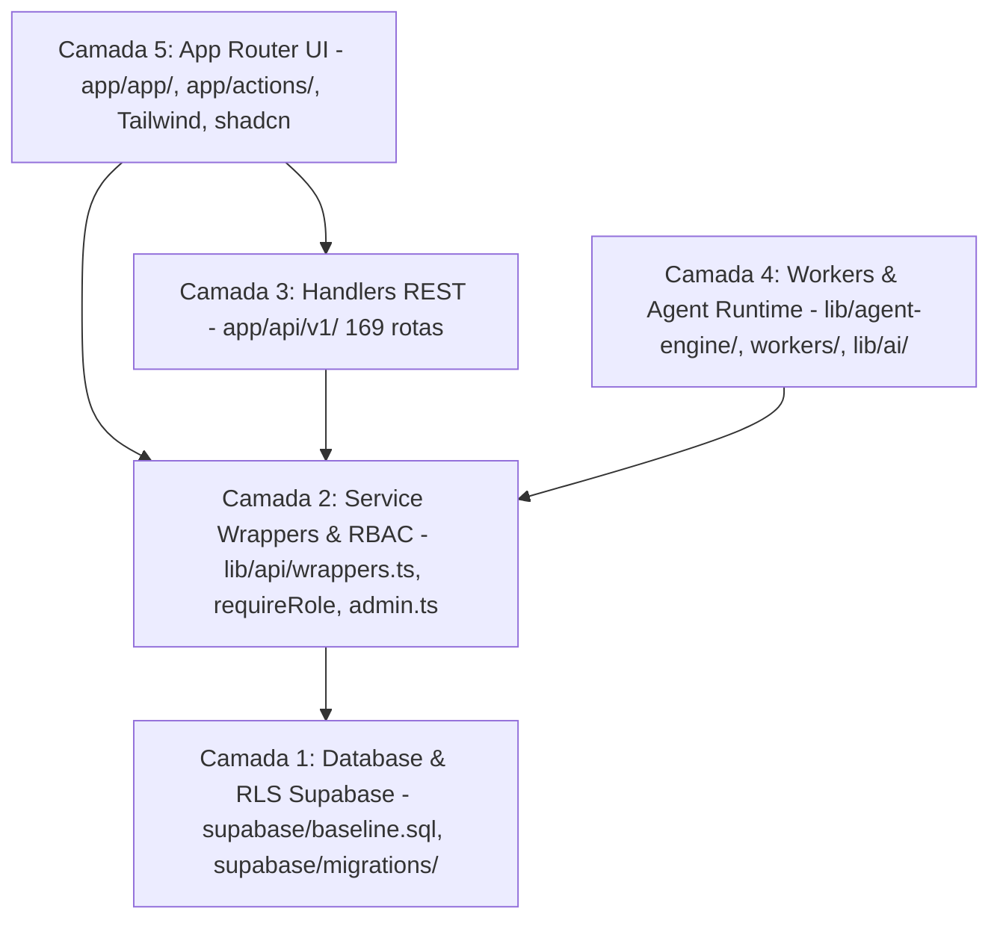
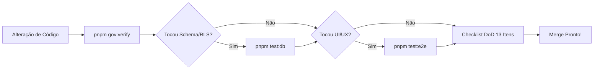

# Guia Definitivo de Vibe Coding no DeskcommCRM

> Como codar na velocidade do pensamento usando Inteligência Artificial sem quebrar governança multi-tenant, segurança RLS ou a estabilidade de self-host do produto.

---

## 1. O que é Vibe Coding no DeskcommCRM

**Vibe Coding** no DeskcommCRM não é apenas gerar código rápido com LLMs — é a prática de **desenvolvimento hiper-acelerado com IA mantendo rigor técnico absoluto, governança estrita e zero degradação da arquitetura**.

Como o DeskcommCRM é um produto distribuído para **self-host em VPS** (onde o usuário final compila e roda a aplicação no seu próprio servidor), qualquer alucinação de IA ou "atalho" que funcione na máquina do desenvolvedor mas quebre num deploy limpo compromete a integridade do produto inteiro.

Para garantir que a velocidade da IA trabalhe a favor do repositório (e não contra ele), o Vibe Coding no DeskcommCRM é sustentado por **3 Pilares Inegociáveis**:



1. **Grafo de Conhecimento (`graphify`)**: Permite que a IA e o desenvolvedor entendam o mapa visual de dependências, comunidades de código e pontos centrais (*god-nodes*) instantaneamente, sem necessitar ler milhares de arquivos brutos.
2. **Invariantes de Banco (`pnpm test:db`)**: Execução de suíte de testes de isolamento multi-tenant (RLS), RBAC e governança em um container Postgres efêmero (pg17). Se a IA quebrar RLS ou vazamento de tenant, o teste falha imediatamente.
3. **Doutrina Não-Negociável (`CLAUDE.md` + `AGENTS.md`)**: As regras de ouro do projeto. Contratos estritos sobre tratamento de erros (`ok()`/`fail()`), isolamento por `organization_id`, logging estruturado, migrations idempotentes e Definition of Done (DoD).

---

## 2. Navegação Inteligente com Graphify (`graphify-out/`)

O repositório do DeskcommCRM possui centenas de rotas, componentes e módulos de IA. Varrer arquivos um a um desperdiça contexto e tokens. O `graphify` extrai e visualiza a estrutura de dependências do repositório.

### Como usar `graphify query "<pergunta>"`
Em vez de pedir para a IA ler diretórios inteiros, execute consultas estruturadas no grafo de conhecimento:
```bash
# Exemplo de consulta por fluxo de mensagens WAHA
graphify query "Como as mensagens do WAHA são processadas até o agent-engine?"
```

### Comandos Essenciais do Graphify
| Comando | Finalidade |
|---|---|
| `graphify update .` | Regenera o grafo de conhecimento após alterações significativas de arquitetura. |
| `graphify explain "<nó>"` | Explica as conexões, chamadores e dependências de uma função, arquivo ou módulo específico. |
| `graphify path "<A>" "<B>"` | Encontra o caminho de chamadas/dependências entre duas partes do sistema (ex: da rota de webhook ao RAG). |

### Navegação em Comunidades e God-Nodes (`graphify-out/GRAPH_REPORT.md`)
O arquivo [`graphify-out/GRAPH_REPORT.md`](file:///d:/Projetos/LowziCRM/graphify-out/GRAPH_REPORT.md) organiza a base de código em **Comunidades Funcionais** e identifica os **God-Nodes** (módulos centrais com alta conectividade, como `lib/supabase/admin.ts` ou `lib/api/wrappers.ts`).
- **Ao alterar um God-Node**: Verifique todas as arestas conectadas via `graphify explain` antes de refatorar.
- **Ao adicionar uma funcionalidade**: Identifique a comunidade correta para colocar o novo arquivo.

### Mapa de Atalhos de Consulta por Domínio

- **Auth & RBAC**:
  - `graphify query "fluxo de autenticação requireRole e Supabase Auth"`
  - Arquivos-chave: [`lib/auth/require-role.ts`](file:///d:/Projetos/LowziCRM/lib/auth/require-role.ts), [`lib/auth/public-paths.ts`](file:///d:/Projetos/LowziCRM/lib/auth/public-paths.ts)
- **WAHA & WhatsApp Integration**:
  - `graphify query "ingestão de webhooks WAHA e salvamento de mensagens"`
  - Arquivos-chave: `app/api/v1/webhooks/waha/route.ts`, `lib/waha/`
- **Agent Runtime & IA**:
  - `graphify query "runtime do agente dispatcher RAG e ferramentas MCP"`
  - Arquivos-chave: `lib/agent-engine/`, `lib/ai/`
- **Pipeline & CRM Core**:
  - `graphify query "movimentação de leads stages e fractional indexing"`
  - Arquivos-chave: `app/api/v1/crm/`, `lib/crm/`
- **Integradores (Nuvemshop, etc.)**:
  - `graphify query "integração Nuvemshop webhooks e sincronização de pedidos"`
  - Arquivos-chave: `app/api/v1/integrations/nuvemshop/`
- **UI & App Router**:
  - `graphify query "componentes de tela do tenant e navegação"`
  - Arquivos-chave: `app/app/`, `lib/navigation/registry.ts`

---

## 3. Mapa das 5 Camadas da Aplicação

O DeskcommCRM é estruturado em 5 camadas bem definidas. Ao desenvolver via Vibe Coding, você deve sempre saber em qual camada está atuando e respeitar seus limites.



### Camada 1: Database & RLS Supabase
- **Localização**: `supabase/baseline.sql`, `supabase/migrations/`
- **Responsabilidade**: Tabela física, índices, funções SQL e Row Level Security (RLS).
- **Regras**: Toda tabela tenant-aware tem coluna `organization_id uuid not null` e política de isolamento. Funções em `public` devem revogar acesso de `public` e `anon`.

### Camada 2: Service Wrappers & RBAC
- **Localização**: [`lib/api/wrappers.ts`](file:///d:/Projetos/LowziCRM/lib/api/wrappers.ts), [`lib/auth/require-role.ts`](file:///d:/Projetos/LowziCRM/lib/auth/require-role.ts), [`lib/supabase/admin.ts`](file:///d:/Projetos/LowziCRM/lib/supabase/admin.ts)
- **Responsabilidade**: Autenticação, autorização por papel (`viewer` < `agent` < `manager` < `admin`), wrappers padrão de API (`ok()`, `fail()`), e clients canônicos do Supabase (`createClient`, `createAdminClient`).

### Camada 3: Handlers REST (169 rotas)
- **Localização**: `app/api/v1/`
- **Responsabilidade**: Endpoints REST da aplicação versionados por URL.
- **Padrão Canônico de Rota**:
  1. Validação de input com **Zod**.
  2. Guard de Auth/RBAC com **`requireRole()`**.
  3. Query com filtro explícito por **`organization_id`**.
  4. Registro de auditoria com **`audit()`** (para mutações POST/PATCH/DELETE).
  5. Retorno usando **`ok(data)`** ou **`fail(code, message, status)`**.

### Camada 4: Workers & Agent Runtime
- **Localização**: `lib/agent-engine/`, `workers/`, `lib/ai/`
- **Responsabilidade**: Motor de execução dos agentes de IA, RAG, integração com Vercel AI Gateway, consumo da tabela `event_log` e rotinas agendadas (crons).

### Camada 5: App Router UI
- **Localização**: `app/app/`, `app/actions/`, componentes Tailwind + shadcn/ui.
- **Responsabilidade**: Interface visual autenticada para o usuário final. Deve consumir chamadas server actions ou rotas REST protegidas.

---

## 4. Regras de Ouro do Vibe Coding (Anti-Falhas)

Para evitar os erros mais comuns cometidos por assistentes de IA e desenvolvedores desatentos, siga as **4 Regras de Ouro**:

### 1. Tenant Isolation Total
> **Toda query DEVE filtrar `organization_id` explicitamente.**

Especialmente ao usar o client `admin.ts` (service role), o Supabase bypassa todas as políticas de RLS. NUNCA confie no payload recebido no `body` da requisição para resolver o `organization_id`; resolva-o sempre a partir de uma fonte confiável (JWT da sessão, cookie validado ou webhook secret).

```typescript
// ❌ INCORRETO: vazamento de segurança e confiança no body
const { organization_id, lead_id } = await req.json();
const supabase = createAdminClient();
const { data } = await supabase.from('crm_leads').select('*').eq('id', lead_id);

// ✅ CORRETO: filtro de tenant derivado do token/sessão autenticada
const auth = await requireRole(req, 'agent');
const supabase = createAdminClient();
const { data } = await supabase
  .from('crm_leads')
  .select('*')
  .eq('id', lead_id)
  .eq('organization_id', auth.organizationId); // Filtro explícito inegociável
```

### 2. Tratamento Padronizado de Respostas (`ok` / `fail`)
> **NUNCA monte `Response` manual nem lance `throw` cru na borda de um Route Handler.**

Utilize exclusivamente os helpers de [`lib/api/wrappers.ts`](file:///d:/Projetos/LowziCRM/lib/api/wrappers.ts) e códigos de erro de [`lib/api/errors.ts`](file:///d:/Projetos/LowziCRM/lib/api/errors.ts).

```typescript
// ❌ INCORRETO
return new Response(JSON.stringify({ error: "Unauthorized" }), { status: 401 });

// ✅ CORRETO
import { ok, fail } from '@/lib/api/wrappers';
import { ApiErrors } from '@/lib/api/errors';

if (!hasPermission) {
  return fail(ApiErrors.FORBIDDEN, 'Acesso negado para este recurso', 403);
}

return ok({ result });
```

### 3. Proibição Absoluta de `console.log`
> **NUNCA commite `console.log` em código mesclado.**

Use o logger estruturado da aplicação (`lib/logger.ts`) ou breadcrumbs do Sentry. Logs desestruturados podem vazar PII (dados pessoais LGPD) ou segredos em ambiente de produção.

```typescript
// ❌ INCORRETO
console.log("Processando webhook:", payload);

// ✅ CORRETO
import { logger } from '@/lib/logger';
logger.info('Processando webhook WAHA', { event: payload.event, orgId });
```

### 4. Segurança de Segredos e Autenticação
> **Use `crypto.timingSafeEqual` em webhooks e NUNCA expor API Keys em Query Strings.**

- API Keys e Bearer tokens devem trafegar unicamente através de Headers HTTP (`Authorization` ou `X-Api-Key`).
- No banco de dados, armazene apenas o hash SHA256 do token (o plaintext é exibido uma única vez ao usuário no momento da criação).
- Validações de HMAC de webhooks devem usar `crypto.timingSafeEqual` para mitigar ataques de timing attack.

---

## 5. Templates de Prompt para Desenvolvedor & IA

Utilize estes templates ao solicitar geração ou modificação de código para garantir que a IA siga o padrão da base de código na primeira tentativa.

### Template A: Adicionar Rota API REST com RBAC e Audit
```text
Crie uma nova rota API REST no path `app/api/v1/[modulo]/route.ts` no repositório DeskcommCRM.

Requisitos obrigatórios:
1. Validação do body/query usando Zod.
2. Guard de autenticação e RBAC via `requireRole(req, 'manager')`.
3. Query executada garantindo filtro explícito por `organization_id: auth.organizationId`.
4. Registro de auditoria usando `audit()` para a mutação.
5. Respostas estruturadas usando os helpers `ok()` e `fail()` de `@/lib/api/wrappers`.
6. Código em TypeScript estrito, sem `console.log` (use `logger`).
```

### Template B: Correção de Bug Sistemática
```text
Preciso corrigir o bug [descreva o problema/issue] no DeskcommCRM.

Antes de alterar o código:
1. Analise o traceback ou comportamento esperado vs atual.
2. Identifique os módulos impactados usando `graphify explain "<arquivo_ou_funcao>"`.
3. Crie ou atualize o teste unitário (`*.test.ts`) em `tests/` que reproduz o erro.
4. Aplique a correção na causa raiz (sem hacks ou mascaramento de erro).
5. Garanta que `pnpm typecheck` e `pnpm test:unit` passem 100% verdes.
```

### Template C: Adicionar Nova Migration Idempotente + Baseline + MANIFEST
```text
Preciso adicionar uma nova tabela/coluna `[nome]` no banco Supabase do DeskcommCRM.

Siga exatamente a Doutrina de Migrations:
1. Crie o arquivo versionado em `supabase/migrations/<timestamp>_<NNNN>_<slug>.sql`.
2. Garanta que todas as instruções sejam idempotentes (`IF NOT EXISTS`, `CREATE OR REPLACE`).
3. Se adicionar função em `public`, revogue privilégios de `public` e `anon`.
4. Adicione o apêndice idempotente no final de `supabase/baseline.sql`.
5. Registre a migration no arquivo `supabase/migrations/MANIFEST.md`.
```

### Template D: Adicionar Tool MCP ou Ação do Agente
```text
Crie uma nova Tool para o Agent Engine em `lib/agent-engine/tools/[nome].ts`.

Requisitos:
1. Defina o schema de entrada usando Zod com descrições claras para a LLM.
2. Receba o contexto do tenant (`organizationId`).
3. Filtre obrigatoriamente todos os dados do banco por `organizationId`.
4. Trate exceções e retorne respostas estruturadas para o agente.
```

---

## 6. Esteira de Validação de Código

Após qualquer alteração via Vibe Coding, a validação é **obrigatória**. Não declare nenhuma tarefa pronta sem executar a esteira correspondente.



### 1. `pnpm gov:verify` (Verificação Básica)
Executa a verificação estática de tipos, lint e testes unitários:
```bash
pnpm gov:verify
# Executa: typecheck (tsc) + lint (eslint) + test:unit (vitest)
```

### 2. `pnpm test:db` (Invariantes de Banco & RLS)
> ⚠️ **`pnpm gov:verify` NÃO testa RLS ou banco.** Se sua mudança tocou schema, RLS ou queries de tenant, você DEVE rodar:
```bash
pnpm test:db
```
*Este comando sobe um container Docker com Postgres pg17 efêmero, aplica o `baseline.sql` em modo install e update, e executa os 364+ testes de invariante e isolamento entre organizações.*

### 3. `pnpm test:e2e` (Testes de Interface com Playwright)
Para alterações em telas (`app/app/`),Server Actions ou fluxos de usuário:
```bash
pnpm test:e2e
```
*Valida a experiência do usuário leigo navegando pela interface em um ambiente idêntico ao de produção.*

### 4. Checklist da Definition of Done (DoD)
Antes de finalizar qualquer tarefa, verifique os 13 pontos da **Definition of Done** do projeto:

- [ ] 1. `pnpm typecheck` passa zerado sem erros.
- [ ] 2. `pnpm lint` passa zerado.
- [ ] 3. Testes unitários/invariantes relevantes existem e passam verdes.
- [ ] 4. Isolamento de RLS testado se a feature toca tabela tenant-aware.
- [ ] 5. Registros de auditoria (`audit()`) emitidos em mutações.
- [ ] 6. Rate limit aplicado em rotas públicas ou sensíveis.
- [ ] 7. Zod valida todo e qualquer input externo.
- [ ] 8. Nenhum `console.log` mantido no código.
- [ ] 9. Variáveis de ambiente novas adicionadas em `.env.example` e `lib/env.ts`.
- [ ] 10. Documentação atualizada (PRD/spec/README) caso tenha alterado contratos.
- [ ] 11. Mudanças de banco adicionadas como migration versionada em `supabase/migrations/` **+** apêndice em `supabase/baseline.sql` **+** linha no `MANIFEST.md`.
- [ ] 12. Se tocou UI: testado e provado no navegador como um usuário real interagiria.
- [ ] 13. Resposta ao *Living System Checklist* confirmando que a feature está conectada ao sistema (com entradas, saídas e logs).

---

*Com este guia, o Vibe Coding no DeskcommCRM entrega o equilíbrio perfeito entre velocidade máxima de IA e qualidade industrial de software.*
