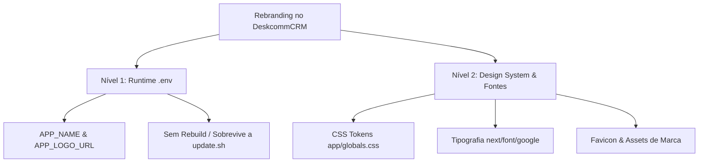

# Guia de Rebranding e Identidade Visual (White-Label) com Vibe Coding

> Como personalizar o DeskcommCRM com sua própria marca — desde ajustes simples sem recompilação via `.env` até rebranding visual completo de alta fidelidade com Design System, tipografia e assets gráficos via Inteligência Artificial.

---

## 1. Visão Geral

O DeskcommCRM foi desenhado com arquitetura **White-Label em 2 Níveis**, atendendo tanto agências/revendedores que necessitam de troca rápida de marca sem re-build quanto operações que buscam customização profunda do Design System.



### Os 2 Níveis de Customização:

1. **Nível 1 (Runtime, Sem Rebuild)**:
   - Configurado via variáveis de ambiente no arquivo `.env` (`APP_NAME` e `APP_LOGO_URL`).
   - **Vantagem crítica**: Não altera o código-fonte nem recompila a aplicação. **Sobrevive integralmente a scripts de atualização (`bash update.sh`)** em ambientes VPS self-host. A imagem Docker pré-buildada lê a marca em tempo de execução.
   
2. **Nível 2 (Design System & Rebranding Completo)**:
   - Alteração direta no código-fonte dos tokens de CSS (`app/globals.css`), esquemas de cores (Light & Dark mode), fontes tipográficas (`app/layout.tsx`), Favicon e ícones de marca.
   - **Ideal para**: Vibe Coding com IA, onde o desenvolvedor ou agência instrui a IA para refatorar o tema visual e gerar assets sob medida.

---

## 2. Rebranding Nível 1: Runtime (.env)

O Nível 1 permite alterar o nome da aplicação e a logotipo exibida na barra lateral e nas telas públicas (login, cadastro, onboarding) em instantes.

### Configuração no `.env`

Adicione ou modifique no seu `.env`:

```bash
# Nome da sua marca/produto
APP_NAME="Vendas Turbo CRM"

# URL pública da sua logo (SVG, PNG ou WebP com fundo transparente recomendado)
APP_LOGO_URL="https://cdn.suaempresa.com.br/logo.svg"
```

Após alterar o `.env`, basta reiniciar os contêineres:
```bash
docker compose up -d
```

### Arquitetura Runtime Server/Client

As variáveis `APP_NAME` e `APP_LOGO_URL` **não** usam o prefixo `NEXT_PUBLIC_`. Isso é proposital e fundamental para o ecossistema self-host:

1. **Servidor**: O Next.js lê `process.env.APP_NAME` e `process.env.APP_LOGO_URL` via helper `branding()` em [`lib/branding.ts`](file:///d:/Projetos/LowziCRM/lib/branding.ts) e gera metadados dinâmicos de página (`generateMetadata()`).
2. **Cliente (Navegador)**: O componente `<PublicEnvScript/>` em [`app/public-env-script.tsx`](file:///d:/Projetos/LowziCRM/app/public-env-script.tsx) injeta essas variáveis de ambiente em `window.__PUBLIC_ENV__` durante o carregamento inicial da página (SSR). O helper `branding()` no client lê essas variáveis globais sem depender de bundle estático.

Dessa forma, atualizações de versão (`update.sh`) puxam imagens oficiais atualizadas sem apagar ou sobrescrever a marca do cliente.

---

## 3. Rebranding Nível 2: Customizando o Design System

Para alterar as cores primárias, superfícies, bordas, estados e tipografia da aplicação, você deve ajustar os tokens do Design System.

### Cores & Tokens CSS (`app/globals.css`)

O DeskcommCRM utiliza tokens CSS nativos em [`app/globals.css`](file:///d:/Projetos/LowziCRM/app/globals.css), mapeados para `:root` (Light mode) e `[data-theme="dark"]` (Dark mode).

#### Mapeamento dos Tokens Principais

| Categoria | Token CSS | Função / Uso na Interface |
|---|---|---|
| **Accent / Marca** | `--color-accent-50` até `--color-accent-950` | Paleta de 11 stops da cor primária/destaque. |
| | `--color-accent` | Cor de acionamento principal (ex: botões primários, links ativos). |
| | `--color-accent-fg` | Cor do texto sobre fundo accent (ex: `#ffffff` em light). |
| | `--color-accent-soft` | Fundo suave para crachás/badges ativos. |
| | `--color-accent-hover` | Estado hover de elementos primários. |
| **Superfícies (BG)** | `--color-bg` | Fundo principal da página. |
| | `--color-surface` | Fundo de cards, tabelas, modais e containers. |
| | `--color-surface-elevated` | Fundo de menus suspensos e dropdowns. |
| **Texto** | `--color-text` | Texto primário de alta legibilidade. |
| | `--color-text-muted` | Texto secundário / descrições. |
| | `--color-text-subtle` | Rótulos, placeholders e metadados. |
| **Bordas** | `--color-border` | Bordas padrão de cards e divisores. |
| | `--color-border-strong` | Bordas de elementos em foco ou ativos. |
| **Estados** | `--color-success` / `-bg` / `-fg` | Sucesso (vendas ganhas, badges de confirmação). |
| | `--color-warning` / `-bg` / `-fg` | Alerta (leads estagnados, avisos). |
| | `--color-error` / `-bg` / `-fg` | Erro / Destrutivo (vendas perdidas, deleção). |
| | `--color-info` / `-bg` / `-fg` | Informação (dicas, notificações). |

#### Como Substituir a Paleta Padrão
Para aplicar uma nova paleta (como **Azul Corporativo**, **Roxo/Violeta**, **Verde Esmeralda** ou **Laranja**), substitua a escala `--color-accent-*` (stops 50 a 950) e os apontamentos `--color-accent` tanto no bloco `:root` quanto no bloco `[data-theme="dark"]` em [`app/globals.css`](file:///d:/Projetos/LowziCRM/app/globals.css).

---

### Tipografia (`app/layout.tsx`)

A tipografia padrão utiliza as fontes **Atkinson Hyperlegible** (para corpo de texto e UI) e **IBM Plex Mono** (para códigos, valores numéricos e logs).

Para substituir a tipografia:
1. Abra [`app/layout.tsx`](file:///d:/Projetos/LowziCRM/app/layout.tsx).
2. Importe a nova fonte do pacote `next/font/google` (ex: `Inter`, `Plus_Jakarta_Sans`, `Outfit`, `Roboto`).
3. Instancie a fonte definindo a variável CSS (ex: `--font-sans` ou `--font-atkinson`).

Exemplo de substituição por **Inter** e **Outfit**:
```typescript
import { Inter, Outfit, IBM_Plex_Mono } from "next/font/google";

const inter = Inter({
  subsets: ["latin"],
  variable: "--font-atkinson", // Substitui a fonte principal do body
});

const outfit = Outfit({
  subsets: ["latin"],
  variable: "--font-display",
});
```

---

### Assets de Marca & Favicon

Os arquivos visuais da marca ficam localizados na pasta de rotas públicas da aplicação `app/`:

- `app/favicon.ico`: Ícone padrão exibido na aba do navegador.
- `app/icon.png`: Ícone PNG de alta resolução para navegadores modernos e PWA.
- `app/apple-icon.png`: Ícone para dispositivos iOS / Apple Web Clip.

Substitua esses arquivos pelos equivalentes da sua marca (mantendo os nomes exatos de arquivo) para atualizar os ícones do aplicativo.

---

## 4. Paleta de Cores Padrão da Aplicação (Sage Palette)

Abaixo está a referência completa da **Paleta Sage (Padrão Atual)** do DeskcommCRM. Utilize esta tabela como guia ao criar novos temas e converter cores Hexadecimal/HSL.

### Accent (Sage Palette)

| Stop | Hexadecimal | Uso em Light Mode (`:root`) | Uso em Dark Mode (`[data-theme="dark"]`) |
|---|---|---|---|
| 50 | `#f3f6f1` | Destaque ultra-suave / backgrounds | Background de destaque pontual |
| 100 | `#e4ebe0` | Background de badges/chips (`--color-accent-soft`) | Fundo claro em alertas |
| 200 | `#c8d6c1` | Seleção de texto (`::selection`) | Bordas suaves de accent |
| 300 | `#a4ba9a` | Bordas ativas em light | Hover de accent em dark (`--color-accent-hover`) |
| 400 | `#82a077` | Accent secundário | **Accent Canônico em Dark (`--color-accent`)** / Ring Focus |
| 500 | `#67885d` | **Accent Canônico em Light / Ring Focus** | Accent para elementos secundários |
| 600 | `#506d48` | **Accent Canônico Padrão (`--color-accent`)** | Fundo de elementos em destaque |
| 700 | `#41573b` | Hover do botão primário em light (`--color-accent-hover`) | Seleção de texto em dark (`::selection`) |
| 800 | `#374731` | Elementos de alto contraste em light | Containers escuros de destaque |
| 900 | `#2f3c2b` | Texto em superfícies accent muito claras | Fundo escuro profundo de destaque |
| 950 | `#171f15` | Texto de seleção (`::selection`) | Fundo ultra-escuro de accent |

### Neutras (Greige)

| Stop / Token | Light Mode (`:root`) | Dark Mode (`[data-theme="dark"]`) | Descrição / Uso |
|---|---|---|---|
| **BG (`--color-bg`)** | `#faf9f6` (Neutral 50) | `#161510` (Neutral 900) | Fundo da aplicação |
| **Surface (`--color-surface`)** | `#ffffff` | `#1d1c17` (Neutral 800) | Fundo de cards, modais e tabelas |
| **Surface Elevated** | `#f5f3ee` (Neutral 100) | `#272620` (Neutral 700) | Fundo de dropdowns e popovers |
| **Border (`--color-border`)** | `#e7e3da` (Neutral 200) | `#33312a` (Neutral 600) | Linhas divisórias e bordas de inputs |
| **Text Muted** | `#5d594f` (Neutral 600) | `#8e8b7f` (Neutral 300) | Subtítulos e textos secundários |
| **Text Primary** | `#1c1a16` (Neutral 900) | `#f5f4ef` (Neutral 50) | Texto principal de alta legibilidade |

### Cores de Estado

| Estado | Token | Hexadecimal (Light) | Hexadecimal (Dark) |
|---|---|---|---|
| **Success** | `--color-success` | `#5a8a5f` | `#82a077` |
| **Warning** | `--color-warning` | `#b07a2b` | `#d09455` |
| **Error** | `--color-error` | `#a94a3c` | `#c87263` |
| **Info** | `--color-info` | `#4a7a93` | `#7da9bf` |

---

## 5. Prompts Prontos para Vibe Coding (Copiar e Colar)

Copie e cole estes prompts diretamente no seu assistente de IA (Claude Code, Antigravity, Cursor, etc.) para realizar rebranding automatizado.

### Prompt A: Trocar apenas a logo e nome da marca no .env
```text
Por favor, atualize o arquivo .env do DeskcommCRM com as seguintes configurações de marca Runtime (Nível 1):
- APP_NAME="Nome Da Sua Marca"
- APP_LOGO_URL="https://link-da-sua-logo.com/logo.png"

Explique como testar e confirme que lib/branding.ts está lendo corretamente.
```

### Prompt B: Substituir a paleta Sage por Azul Corporativo (Blue) em Light e Dark Mode
```text
Por favor, atualize os tokens de cor em app/globals.css para substituir a paleta Sage por um Azul Corporativo (Blue).

Requisitos:
1. No bloco `:root` (Light Mode), altere os stops de `--color-accent-50` até `--color-accent-950` para uma escala baseada em azul (ex: 50=#eff6ff, 500=#3b82f6, 600=#2563eb, 700=#1d4ed8).
2. Configure `--color-accent: var(--color-accent-600)`.
3. No bloco `[data-theme="dark"]`, ajuste os stops para garantir contraste excelente no escuro com `--color-accent: var(--color-accent-400)`.
4. Mantenha intactos todos os aliases da shadcn e a densidade aerada.
```

### Prompt C: Trocar fontes para Inter e Outfit em todo o app
```text
Atualize a tipografia do DeskcommCRM no arquivo app/layout.tsx:
1. Substitua Atkinson_Hyperlegible e IBM_Plex_Mono por Inter e Outfit de `next/font/google`.
2. Configure Inter como a fonte principal na variável `--font-atkinson` (para manter compatibilidade com app/globals.css).
3. Garanta que `subsets: ["latin"]` e `display: "swap"` estejam configurados.
4. Rode `pnpm typecheck` para verificar que a alteração compila sem erros.
```

### Prompt D: Rebranding Total 360° (Nome, Logo, Cores, Fontes e Favicon)
```text
Realize um Rebranding Total 360° no DeskcommCRM para a empresa "Nexum Tech":
1. Altere .env e .env.example para incluir APP_NAME="Nexum Tech" e APP_LOGO_URL="https://nexumtech.com/logo.svg".
2. Em app/globals.css, substitua a paleta Sage por uma paleta Roxo/Violeta moderno (stops 50=#f5f3ff a 950=#2e1065) em Light e Dark mode.
3. Em app/layout.tsx, substitua a fonte principal pela fonte Plus_Jakarta_Sans de `next/font/google`.
4. Atualize o arquivo docs/white-label.md se necessário.
5. Verifique os tipos com `pnpm typecheck` e execute `pnpm test:unit` para garantir estabilidade.
```

---

## 6. Preservação de Updates & Checklist de Validação Visual

### Preservando Modificações durante Atualizações (`git` / `update.sh`)

Quando você realiza alterações de Nível 2 (código CSS ou layout), essas alterações são commits ou patches locais no repositório Git.

1. **Trabalhe em um Branch Dedicado**:
   Crie uma branch de rebranding para a sua marca:
   ```bash
   git checkout -b rebranding/minha-marca
   ```
2. **Rebase ao Atualizar o Código-Fonte**:
   Ao atualizar a versão do DeskcommCRM upstream:
   ```bash
   git fetch origin
   git rebase origin/main
   ```

### Checklist de Validação Visual pós-Rebranding

Antes de publicar o seu ambiente customizado em produção, execute a validação:

- [ ] **1. Identidade no Navegador**: O nome e logo no `.env` aparecem na aba do navegador e na barra lateral sem recompilar.
- [ ] **2. Contraste Light Mode**: Botões primários (`--color-accent`), textos e bordas possuem contraste acessível (WCAG AA) no tema claro.
- [ ] **3. Contraste Dark Mode**: O alternador de tema funciona perfeitamente e os elementos em Dark mode não possuem fundos lavados ou ilegíveis.
- [ ] **4. Responsividade de Logo**: Logos com formatos verticais ou horizontais são renderizadas sem distorção na sidebar.
- [ ] **5. Build & Testes**: `pnpm typecheck` e `pnpm test:unit` passam 100% verdes sem regressões.

---

*Última atualização: 6 de agosto de 2026.*
